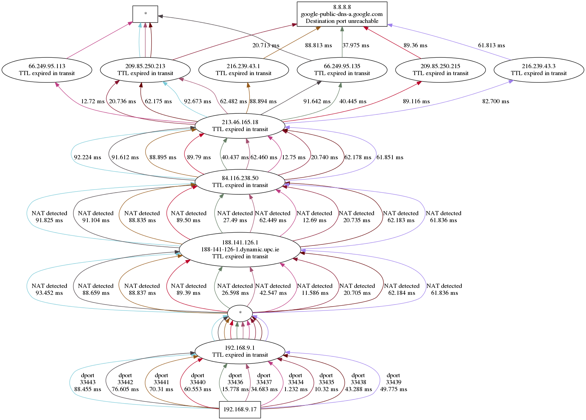

## Examples

You can invoke Dublin-traceroute in multiple ways. So far there are:

* a command-line tool, ```dublin-traceroute```,
* a C++ library, ```libdublintraceroute.so```,
* a Python module, ```dublintraceroute```, which now lives in a separate repository, see [python-dublin-traceroute](https://github.com/insomniacslk/python-dublin-traceroute).

### Using the command-line tool

NOTE: the CLI tool is still in development and lacks many features.

The basic usage of ```dublin-traceroute ``` is the following:

```bashed
$ dublin-traceroute <target>
```

For example, you can traceroute Google's public DNS server as follows:

```bash
$ dublin-traceroute 8.8.8.8
```

The current default is to probe 20 different paths with a maximum TTL set to 30.

You will see the output on the terminal, but ```dublin-traceroute``` will also
create a file named ```trace.json``` in the current directory. You can run the
script located at ```scripts/to_graphviz.py``` to generate an image showing graphically
the traceroute. The image file is named ```trace.json.png```. For example:

```bash
$ dublin-traceroute 8.8.8.8
... <output of the traceroute>
$ python scripts/to_graphviz.py trace.json
$ eog trace.json.png # or open it with your favourite viewer
```

The image will look something like this:



You can view the content of ```trace.json``` of course, and use it as needed.

### Using Python

The Python bindings have been split into a separate package. See
[python-dublin-traceroute](https://github.com/insomniacslk/python-dublin-traceroute) .


### Using the C++ library

TODO

Meanwhile, you can look at [the implementation of the command-line tool](../../src/main.cc)
